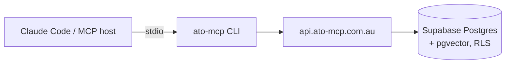

<div align="center">

# ato-mcp

**The Australian tax knowledge base for AI agents.**

Give Claude (or any MCP host) cited, current retrieval over 29,000+ ATO documents —
plus a personal-facts layer and four tax workflow tools that know *your* situation.

[ato-mcp.com.au](https://ato-mcp.com.au) · [Tool reference](docs/tools.md) · [Changelog](CHANGELOG.md)

[](https://github.com/william-laverty/ato-mcp/actions/workflows/ci.yml)
[](https://www.npmjs.com/package/ato-mcp)
[](LICENSE)
[](https://nodejs.org)

</div>

---

Ask your agent *"can I claim my home office?"* and it answers from the actual ATO guidance,
the actual ITAA 1997 section, and the actual ruling — with citations you can resolve and read —
instead of from training-data vibes. Tell it once that you're a GST-registered sole trader with
crypto, and every answer is branched for *your* taxpayer shape.

## What's in the corpus

| Source | Contents |
|---|---|
| **ato.gov.au** | 24,500+ guidance pages, forms & instructions, occupation guides, myTax help |
| **ITAA 1997** | 4,638 sections + 1,929 statutory definitions (point-in-time aware) |
| **ATO public rulings** | 2,127 rulings across 10 types (TR, TD, GSTR, GSTD, PR, CR, LCR, PCG, MT, FTR) |
| **Citation graph** | 23,267 cross-references between rulings and legislation |
| **Thresholds** | Time-keyed scalars (instant asset write-off, GST registration, CGT discount, super caps, …) |

**29,861 documents · 209,588 chunks**, embedded and hybrid-indexed (BM25 + vector), rebuilt monthly.

## The 13 tools

**Retrieval** — `search` (hybrid BM25+vector), `get_chunks`, `get_doc`, `get_doc_anchors`
(citation graph), `get_definition` (statutory, point-in-time), `get_threshold` (time-keyed
scalars), `fetch` (live page fetch), `stats`.

**Personal context** — `get_user_facts`: 25 facts captured once at onboarding (business
structure, GST registration, investments, super type, residency, …) so the agent never re-asks.

**Workflows** — the reason this exists:

| Tool | What it does |
|---|---|
| `deduction_discovery` | Surfaces **every deduction category** that plausibly applies to your profile — 59-category curated taxonomy, branched across sole traders, companies, trusts, partnerships, investors and SMSF members, each with live citations and a confidence rating |
| `depreciation_helper` | Deterministic prime-cost / diminishing-value / instant-write-off / small-business-pool / Div 43 schedules for any asset, with the live IAWO threshold |
| `bas_prep_checklist` | A tiered, cited BAS checklist for your reporting period — which labels apply, what evidence to gather, the gotchas |
| `audit_risk_check` | Flags the patterns the ATO scrutinises in a draft return (WRE vs income, rental anomalies, unreported crypto, …) with risk bands and the guidance behind each flag |

Every workflow tool returns **structured data + resolvable ATO citations — never advice in its
own voice**. See the [full tool reference](docs/tools.md).

## Quick start

Get your token at **https://ato-mcp.com.au/onboard**, then add to your MCP client config:

```json
{ "mcpServers": { "ato-mcp": { "command": "npx", "args": ["-y", "ato-mcp"],
    "env": { "ATO_MCP_TOKEN": "<your-token>" } } } }
```

The client forwards every tool call to `api.ato-mcp.com.au` over TLS. There is no
local corpus to download.

## How it works



```
packages/
├── shared/    Types, Zod schemas, Store/Embedder interfaces, all 13 tool implementations
├── mcp/       The npm package: stdio MCP server + CLI (npx -y ato-mcp)
├── backend/   Vercel functions over Supabase Postgres + pgvector
└── web/       ato-mcp.com.au — Next.js onboarding, account, schema-driven privacy policy
```

## Privacy, by construction

No tool names, no query content, no results are ever stored — the analytics schema physically has
nowhere to put them. The [privacy page](https://ato-mcp.com.au/privacy) is rendered from
`UserFactsSchema` at build time and a contract test fails if any stored field is undocumented.
Per-user rows are isolated with Postgres row-level security; bearer tokens are stored as SHA-256
hashes and revocable from the account page. The client, shared tool logic, hosted backend and
this website are in this repository — verify, don't trust.

## Development

```bash
pnpm install && pnpm -r build
pnpm -r test            # TypeScript suites (shared, mcp, backend, web)
```

See [CONTRIBUTING.md](CONTRIBUTING.md) for conventions and [RELEASING.md](RELEASING.md) for the
release process.

## Important disclaimer

ato-mcp is **information infrastructure, not tax advice**. It retrieves and structures published
ATO material and computes deterministic schedules; it does not consider your full circumstances
and it is not a registered tax agent service. Confidence ratings and risk bands are heuristic
indicators, not professional judgement. Verify material decisions with a registered tax agent —
and read the [terms](https://ato-mcp.com.au/terms).

ATO content remains subject to ATO publication terms. ITAA 1997 text is reproduced from the
Federal Register of Legislation under its open licensing.

## License

[MIT](LICENSE) © William Laverty
