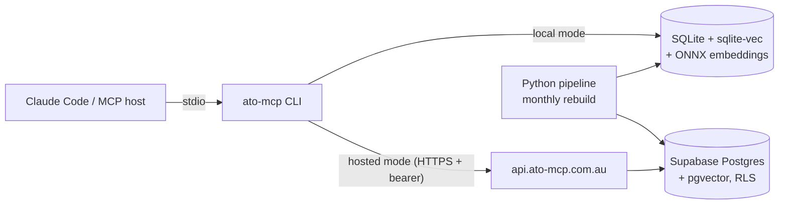

<div align="center">

# ato-mcp

**The Australian tax knowledge base for AI agents.**

Give Claude (or any MCP host) cited, current retrieval over 29,000+ ATO documents —
plus a personal-facts layer and four tax workflow tools that know *your* situation.

[ato-mcp.com.au](https://ato-mcp.com.au) · [Tool reference](docs/tools.md) · [Self-hosting](docs/self-hosting.md) · [Changelog](CHANGELOG.md)

[](https://github.com/william-laverty/ato-mcp/actions/workflows/ci.yml)
[](https://www.npmjs.com/package/@ato-mcp/mcp)
[](LICENSE)
[](https://nodejs.org)

</div>

---

Ask your agent *"can I claim my home office?"* and it answers from the actual ATO guidance,
the actual ITAA 1997 section, and the actual ruling — with citations you can resolve and read —
instead of from training-data vibes. Tell it once that you're a GST-registered sole trader with
crypto, and every answer is branched for *your* taxpayer shape.

## What's in the corpus

| Source | Contents |
|---|---|
| **ato.gov.au** | 24,500+ guidance pages, forms & instructions, occupation guides, myTax help |
| **ITAA 1997** | 4,638 sections + 1,929 statutory definitions (point-in-time aware) |
| **ATO public rulings** | 2,127 rulings across 10 types (TR, TD, GSTR, GSTD, PR, CR, LCR, PCG, MT, FTR) |
| **Citation graph** | 23,267 cross-references between rulings and legislation |
| **Thresholds** | Time-keyed scalars (instant asset write-off, GST registration, CGT discount, super caps, …) |

**29,181 documents · 224,585 chunks**, embedded and hybrid-indexed (BM25 + vector), rebuilt monthly.

## The 13 tools

**Retrieval** — `search` (hybrid BM25+vector), `get_chunks`, `get_doc`, `get_doc_anchors`
(citation graph), `get_definition` (statutory, point-in-time), `get_threshold` (time-keyed
scalars), `fetch` (live page fetch), `stats`.

**Personal context** — `get_user_facts`: 25 facts captured once at onboarding (business
structure, GST registration, investments, super type, residency, …) so the agent never re-asks.

**Workflows** — the reason this exists:

| Tool | What it does |
|---|---|
| `deduction_discovery` | Surfaces **every deduction category** that plausibly applies to your profile — 59-category curated taxonomy, branched across sole traders, companies, trusts, partnerships, investors and SMSF members, each with live citations and a confidence rating |
| `depreciation_helper` | Deterministic prime-cost / diminishing-value / instant-write-off / small-business-pool / Div 43 schedules for any asset, with the live IAWO threshold |
| `bas_prep_checklist` | A tiered, cited BAS checklist for your reporting period — which labels apply, what evidence to gather, the gotchas |
| `audit_risk_check` | Flags the patterns the ATO scrutinises in a draft return (WRE vs income, rental anomalies, unreported crypto, …) with risk bands and the guidance behind each flag |

Every workflow tool returns **structured data + resolvable ATO citations — never advice in its
own voice**. See the [full tool reference](docs/tools.md).

## Quick start

### Hosted mode (recommended — no download)

1. Onboard at **[ato-mcp.com.au/onboard](https://ato-mcp.com.au/onboard)** — magic-link sign-in,
   a 2-minute facts wizard, and you get a bearer token + install snippet.
2. Add to Claude Code:

```bash
npm install -g @ato-mcp/mcp
ato-mcp onboard        # opens the browser, writes ~/.ato-mcp/config.json
claude mcp add ato-mcp -- ato-mcp mcp
```

Queries run against `api.ato-mcp.com.au` over TLS. Tool calls are **never logged** — see the
[privacy policy](https://ato-mcp.com.au/privacy) (it's generated from the database schema, so it
can't drift from reality).

### Local mode (private, offline)

Everything on your machine: the corpus is a ~1 GB SQLite file, embeddings run locally via ONNX,
and no query ever leaves your device.

```bash
npm install -g @ato-mcp/mcp
ato-mcp update         # downloads + sha256-verifies the latest corpus release
claude mcp add ato-mcp -- ato-mcp mcp
```

> Requires Node 22+ and `zstd` (`brew install zstd` / `apt install zstd`). The corpus snapshot is
> identical to the one hosted mode serves.

### Any other MCP host

```json
{
  "mcpServers": {
    "ato-mcp": { "command": "ato-mcp", "args": ["mcp"] }
  }
}
```

## How it works



One shared TypeScript tool core (`packages/shared`) runs identically in both modes — the only
difference is the storage adapter (`SqliteStore` vs `SupabaseStore`) and the embedder. Behaviour
cannot drift between local and hosted.

```
packages/
├── shared/    Types, Zod schemas, Store/Embedder interfaces, all 13 tool implementations
├── mcp/       The npm package: stdio MCP server + CLI (update / onboard / stats / mcp)
├── backend/   Hosted mode: Vercel functions over Supabase Postgres + pgvector
├── web/       ato-mcp.com.au — Next.js onboarding, account, schema-driven privacy policy
└── pipeline/  Python (uv) corpus builder: scrape → clean → chunk → embed → package
```

## Privacy, by construction

- **Local mode:** queries never leave your machine. Full stop.
- **Hosted mode:** no tool names, no query content, no results are ever stored — the analytics
  schema physically has nowhere to put them. The [privacy page](https://ato-mcp.com.au/privacy)
  is rendered from `UserFactsSchema` at build time and a contract test fails if any stored field
  is undocumented.
- Per-user rows are isolated with Postgres row-level security; bearer tokens are stored as
  SHA-256 hashes and revocable from the account page.
- The entire stack — including the hosted backend — is in this repository. Verify, don't trust.

## Development

```bash
pnpm install && pnpm -r build
pnpm -r test            # TypeScript suites (shared, mcp, backend, web)
cd packages/pipeline && uv sync && uv run pytest -k "not slow"
```

See [CONTRIBUTING.md](CONTRIBUTING.md) for conventions, [docs/self-hosting.md](docs/self-hosting.md)
to run your own hosted stack, and [RELEASING.md](RELEASING.md) for the release process.

## Important disclaimer

ato-mcp is **information infrastructure, not tax advice**. It retrieves and structures published
ATO material and computes deterministic schedules; it does not consider your full circumstances
and it is not a registered tax agent service. Confidence ratings and risk bands are heuristic
indicators, not professional judgement. Verify material decisions with a registered tax agent —
and read the [terms](https://ato-mcp.com.au/terms).

ATO content remains subject to ATO publication terms. ITAA 1997 text is reproduced from the
Federal Register of Legislation under its open licensing.

## License

[MIT](LICENSE) © William Laverty
