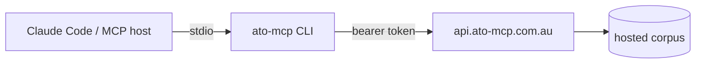

<div align="center">

# ato-mcp

**The Australian tax knowledge base for AI agents.**

Give Claude (or any MCP host) cited, current retrieval over 34,500+ ATO documents —
plus a personal-facts layer and four tax workflow tools that know *your* situation.

[ato-mcp.com.au](https://ato-mcp.com.au) · [Tool reference](docs/tools.md) · [Changelog](CHANGELOG.md)

[](https://github.com/william-laverty/ato-mcp/actions/workflows/ci.yml)
[](https://www.npmjs.com/package/ato-mcp)
[](LICENSE)
[](https://nodejs.org)

</div>

---

Ask your agent *"can I claim my home office?"* and it answers from the actual ATO guidance,
the actual ITAA 1997 section, and the actual ruling — with citations you can resolve and read —
instead of from training-data vibes. Tell it once that you're a GST-registered sole trader with
crypto, and every answer is branched for *your* taxpayer shape.

## What's in the corpus

| Source | Contents |
|---|---|
| **ato.gov.au** | 23,000+ guidance pages, forms & instructions, occupation guides, myTax help |
| **Legislation** | ITAA 1997, ITAA 1936 and the GST Act — 6,468 sections + 2,310 statutory definitions (point-in-time aware) |
| **ATO public rulings** | 4,900+ rulings across 10 types (TR, TD, GSTR, GSTD, PR, CR, LCR, PCG, MT, FTR), withdrawn rulings flagged |
| **Citation graph** | 64,217 cross-references between rulings and legislation |
| **Thresholds** | Time-keyed scalars (instant asset write-off, GST registration, CGT discount, super caps, …) |

**34,500+ documents (286,000+ searchable passages), hybrid-indexed (BM25 + vector)**, refreshed monthly and served from
the hosted platform.

## The 13 tools

**Retrieval** — `search` (hybrid BM25+vector), `get_chunks`, `get_doc`, `get_doc_anchors`
(citation graph), `get_definition` (statutory, point-in-time), `get_threshold` (time-keyed
scalars), `fetch` (live page fetch), `stats`.

**Personal context** — `get_user_facts`: 25 facts captured once at onboarding (business
structure, GST registration, investments, super type, residency, …) so the agent never re-asks.

**Workflows** — the reason this exists:

| Tool | What it does |
|---|---|
| `deduction_discovery` | Surfaces **every deduction category** that plausibly applies to your profile — a curated, cited taxonomy branched across sole traders, companies, trusts, partnerships, investors and SMSF members |
| `depreciation_helper` | Deterministic prime-cost / diminishing-value / instant-write-off / small-business-pool / Div 43 schedules for any asset, with the live IAWO threshold |
| `bas_prep_checklist` | A tiered, cited BAS checklist for your reporting period — which labels apply, what evidence to gather, the gotchas |
| `audit_risk_check` | Flags the patterns the ATO scrutinises in a draft return (WRE vs income, rental anomalies, unreported crypto, …) with risk bands and the guidance behind each flag |

Every workflow tool returns **structured data + resolvable ATO citations — never advice in its
own voice**. See the [full tool reference](docs/tools.md).

## Quick start

Add the hosted server to your client — one line, then sign in with your browser:

```bash
claude mcp add --transport http ato https://api.ato-mcp.com.au/mcp
```

Then run `/mcp` inside Claude Code and choose **Authenticate**. Codex, Gemini CLI,
Cursor, VS Code, Windsurf, Claude.ai and ChatGPT instructions live at
**[ato-mcp.com.au/install](https://ato-mcp.com.au/install)**.

<details>
<summary>Token-based setup (this npm client)</summary>

Get a token at **https://ato-mcp.com.au/onboard**, then add to your MCP client config:

```json
{ "mcpServers": { "ato-mcp": { "command": "npx", "args": ["-y", "ato-mcp"],
    "env": { "ATO_MCP_TOKEN": "<your-token>" } } } }
```

</details>

## How it works

Most MCP hosts connect straight to `api.ato-mcp.com.au/mcp` over streamable HTTP and sign
in with a browser — no client-side package required. This repository is a separate,
token-based option: a small, dependency-light stdio program for hosts that don't yet speak
remote MCP.



It reads `ATO_MCP_TOKEN`, speaks MCP over stdio, and forwards each tool call to
the hosted API. Because it's open source, you can audit exactly what leaves your machine —
your queries go to the ato-mcp API and nowhere else. The retrieval platform and the corpus
are maintained privately.

## Privacy, by construction

No tool names, no query content, no results are ever stored — the analytics schema physically
has nowhere to put them. See the [privacy policy](https://ato-mcp.com.au/privacy), which is
generated from the stored-data schema itself. Per-user rows are isolated with Postgres
row-level security; bearer tokens are stored as SHA-256 hashes and revocable from the
[account page](https://ato-mcp.com.au/account).

## Development

```bash
pnpm install && pnpm -r build
pnpm -r test
pnpm test:smoke
```

See [CONTRIBUTING.md](CONTRIBUTING.md) for conventions and [RELEASING.md](RELEASING.md) for the
release process.

## Important disclaimer

ato-mcp is **information infrastructure, not tax advice**. It retrieves and structures published
ATO material and computes deterministic schedules; it does not consider your full circumstances
and it is not a registered tax agent service. Confidence ratings and risk bands are heuristic
indicators, not professional judgement. Verify material decisions with a registered tax agent —
and read the [terms](https://ato-mcp.com.au/terms).

ATO content remains subject to ATO publication terms. ITAA 1997 text is reproduced from the
Federal Register of Legislation under its open licensing.

## License

[MIT](LICENSE) © William Laverty — applies to this client. The hosted platform and corpus
are proprietary.
